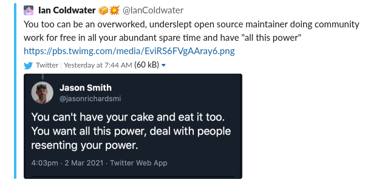

So I want to talk about power and how it is wielded.
This runs in correlation to the [twitter](https://twitter.com/stephenaugustus/status/1367007984103153666) threads I took part in about Kubecon CFPs.
As this post progresses, please keep in mind this is not a rant about
Kubecon, this is a piece on power. The Kubecon situation is just being used to demonstrate how power
is wielded. I also want to point out that, I have no dog in the Kubecon
fight.  I did not submit a topic this year and probably never will.

The rightness or wrongness of this power is not the topic I want to discuss.

I want to discuss how it manifests itself and how those in power utilize it to reinforce
its existence. When I discuss those in power I want to clarify, not everyone that has it
knows they are wielding it or using the tools to defend it.
Like most hegemonic systems not all people realize they are taking part in an exertion of power,
but some of them are fully aware and take advantage of it.

I have covered the [Kubecon scenario](https://twitter.com/jasonrichardsmi/status/1366871803067568136) at length enough and how the CFP process appears to be
an undemocratic and opaque process. I want to talk now about how the system re-enforces
itself in the resulting conversations.
I want to add a disclaimer. I have done some research into how the program committee is
assigned, but this information was not particularly easy to find. But it appears from my
interactions from the Twitter discussions, my conclusions were accurate.

First, is the [document](https://events.linuxfoundation.org/kubecon-cloudnativecon-north-america/program/scoring-guidelines/) purported to define how CFPs are reviewed. I was directed to the document
in question and it was accompanied by some follow up [comments](https://twitter.com/stephenaugustus/status/1367003080668102656) which expressed exasperation
at not being able to research, and how it was freely available for anyone to review.
This is a form of gaslighting, basically I must lack reading comprehension or I am trolling,
because everything is right there.

The document itself, being open to the public to review is "evidence" of the openness
of the process.  Unfortunately the document itself is one small piece in a much larger picture.
Several times I asked:

1. Who are the deciders and how are they appointed
2. Where is the reasoning for each decision published

Neither of those questions are answered because they are actually where power is derived.
Given the power to decide, knowing who the applicants work for and who they are, and being able
to keep that reasoning secret is where the power resides. Those 2 questions were never answered.
Instead I was sent to the suggestion box, every time I asked those questions.

["If you actually intend to provide actionable feedback
(which we're interested in), please use official channels."](https://twitter.com/stephenaugustus/status/1367006175288561670)
 
This is the suggestion box. This is another avenue of control. The suggestion box is basically controlling
the channels of communication, who sees them and if they are even responded to.
Several times I was directed to the suggestion box because, Twitter was not the preferred
avenue for the discussion, according to those in power. For all its flaws, Twitter
allowed me a person with no power,
no followers, etc the ability to make my voice heard in a public forum. Power does not want to be
questioned in a public forum by someone with no power. This all being ironic because those
with power were using Twitter to air their grievances. If you question those grievances, and
question the processes those with power own that may have caused those grievances,
well "lets talk in private".

Several comments revolved around "protecting my team", "be kind", "I volunteer", etc.
This is again another tactic of power. By depicting themselves as hard working, self sacrificing
victims of the unappreciative mob, and pointing out how they have sacrificed all their time for us,
they take on the role of "benevolent benefactor". This is another avenue of power. The fact
that these reviewers are selected and not everyone could be a reviewer, also negates this
discussion. You cannot hold someone in high regard for self sacrifice, when the other people
are not allowed to take part in the same self sacrifice.

Also several comments about "Maybe you should be more like this person".
This is attempt to degrade those that challenge power. If I was more like a person with power,
I would be an altogether better person. But what if I don't want to be like the person in power,
my goals do not align with said person, am I a lesser person? I can't imagine a world where
complete homogeneity of personalities would benefit anyone.

Finally the last attempt to justify power is to attack those that question that power.
This was built on an attempt to discrediting or demonize me.

Unfortunately the tweet was deleted so I was unable to capture all the comments surrounding it.
Thanks to Slack local cache I was able to acquire the above.

A comment by me was taken out of context in a
screenshot and posted by someone with power.  They were not only powerful because
they were part of the group that makes the Kubecon decisions, but they had a large number
of Twitter followers.

This tactic served several purposes:

It attempts to take away my agency in the dialog. A link to my
comment would have notified me and allowed me to respond. (Fortunately my network let me know)

By taking my comment out of context, it allows this person to avoid having to address
the context of the entire thread I posted.

The comment itself could be interpreted as possibly hostile by itself but in the context of
the entire thread, I would hope it would not.

When this demonstration of
power did not pan out (maybe it did, someone called me toxic), the tweet attempting to
discredit me was deleted. In effect erasing history, erasing the attack on me.

As stated before people do not always know they wield power and some do and abuse it.
I don't believe this situation unfolded with the intention to abuse power,
I believe it was built on not being aware of that power. I believe it was built on a societies
flawed ideals, anger, resentment, pride and most of all greed.

If we have no ill intent but exercise power negatively over others, how can we be better?
I think we all need to be aware of our power or at least open to when someone identifies that power.
We should also be critical of how we have acquired power, was it fair and democratic,
was it transparent?

As a colleague pointed out for this situation, there are a number of commercial interests that
have a financial motivations to maintain their power over the messaging about products and services.
Some want to show how they are a cool place to work, in a market desperate for qualified engineers?
Some just want to advocate patterns where they hope to lead the market. One should never trust
these commercial interests.  Those interests will always be willing to fill your ego, wallet
and CV as long as you act as a proxy to their power and greed.

If you take on the mantle of power, you must accept the responsibilities that comes
with it, to include dealing with people that do not like what you do with that power. If anyone ever
expresses to you "you screwed me over", that usually indicates they believe you have power over them.
Step back and ask yourself if you do.  If 10 people tell you that around the same time, you most
likely do have the power, even though you may ultimately have been fair, the power exists and you
are answerable to them.

**If** you recognize the power and don't feel answerable to them or you don't care how that impacts
them, then you are abusing power.

This brings us to a very important point.  We all have heard some expression of resentment from
others. This is because we all exercise power, from work, to family, to school to crossing the
street. We cannot escape power in our lives. We use it and surrender it all the time.
If you hire a plumber to fix a busted pipe, you are surrendering dominion over the pipe and
possibly the safety of your home, to the plumber, which is why you would research his credentials
first. But when you hire that plumber you have agency, when people don't have agency in the
power you wield, expect to hear about it.

